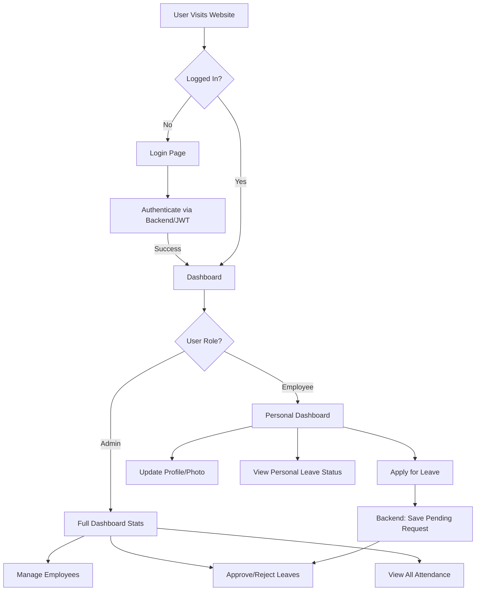

# Employee Management System (EMS) - Project Documentation

This document provides a complete overview of the project's architecture, features, and implementation details.

## 1. Project Overview
The Employee Management System is a full-stack web application designed to streamline HR processes, including employee records, leave management, and organizational analytics.

## 2. Technology Stack

### Frontend (User Interface)
- **React.js**: Core framework for building the single-page application (SPA).
- **Ant Design & React Bootstrap**: UI libraries used for professional-grade components like tables, modals, and forms.
- **Axios**: Used for making HTTP requests to the backend API.
- **React Router**: Handles navigation between different pages (Dashboard, Login, Profile).
- **Nivo / Chart.js**: Powerful libraries for data visualization (Employee stats, Leave trends).

### Backend (Server & API)
- **Node.js**: JavaScript runtime environment.
- **Express.js**: Web framework for building the RESTful API.
- **JWT (JSON Web Tokens)**: Used for secure user authentication and session management.
- **Bcrypt.js**: Handles secure password hashing.
- **Multer**: Middleware for handling multipart/form-data, used for profile picture uploads.

### Database (Data Storage)
- **MySQL**: Relational database used for structured data (Users, Leaves, Departments).
- **MySQL2**: Driver for connecting Node.js to the MySQL database with support for connection pooling and promises.

---

## 3. Key Features

### Authentication System
- **Secure Login**: Role-based access control (Admin vs. Employee).
- **Token-based Security**: Every private request is validated using a JWT in the `Authorization` header.

### Admin Dashboard
- **Headcount Summary**: Real-time count of total employees and their designations.
- **Daily Leave Status**: Instant visibility into who is absent or on leave today.
- **Analytics**: Visual charts showing the distribution of employees and leave history.

### Leave Management
- **Employee Portal**: Apply for leaves with specific dates and reasons.
- **Admin Control**: A dedicated interface for Admins to review, approve, or reject pending leave requests.
- **Status Updates**: Real-time feedback for employees on their request status.

### Profile Management
- **Employee Directory**: Centralized list of all employees (Admin view).
- **Personal Profiles**: Employees can view their own data and update their profile pictures.

---

## 4. Logical Workflow (Flowchart)

---

## 5. Implementation Roadmap

### Phase 1: Database Setup
The file `database/mysqlDb.js` initializes the connection and creates the necessary tables (`users`, `departments`, `attendance`, `leave_requests`) automatically.

### Phase 2: Backend Logic (Controllers)
- `userController.js`: Handles registration, login, and user data updates.
- `leaveContoller.js`: Manages the logic for applying and approving leaves.

### Phase 3: Frontend Integration
- **Context API**: `userContext.js` stores the user's login state globally.
- **Navigation**: `MainNav.js` displays different menu items based on whether a user is an Admin or an Employee.

---

## 6. How to Run the Project
1. **Database**: Ensure MySQL is running and a `.env` file exists with your `DB_PASSWORD`.
2. **Admin Setup**: Run `node create-admin.js` in the backend folder to create the first user.
3. **Start**: Run `npm run ems` from the backend folder to launch both the server and the UI.
